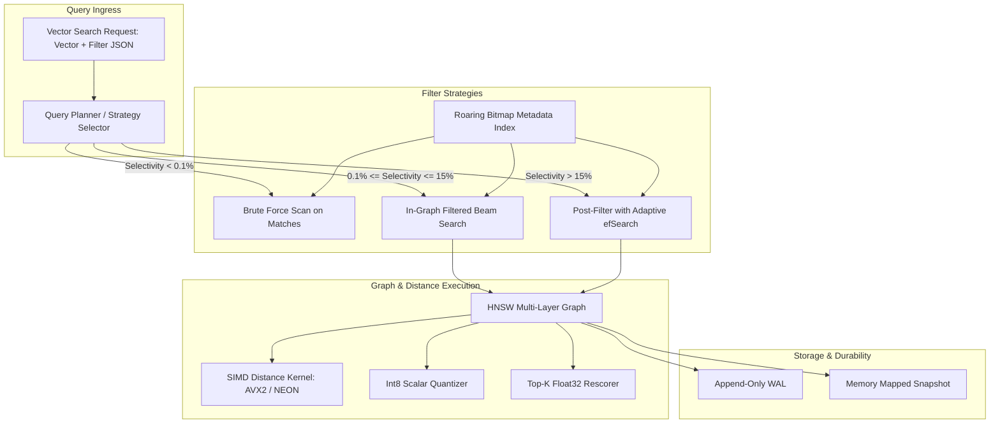

# 03 - Architecture & Component Design: HNSW Index

```mermaid
graph TD
    subgraph Query Ingress
        REQ[Vector Search Request: Vector + Filter JSON]
        QP[Query Planner / Strategy Selector]
        REQ --> QP
    end

    subgraph Filter Strategies
        ROARING[Roaring Bitmap Metadata Index]
        QP -->|Selectivity < 0.1%| BF[Brute Force Scan on Matches]
        QP -->|0.1% <= Selectivity <= 15%| IN_GRAPH[In-Graph Filtered Beam Search]
        QP -->|Selectivity > 15%| POST[Post-Filter with Adaptive efSearch]
        ROARING --> BF
        ROARING --> IN_GRAPH
        ROARING --> POST
    end

    subgraph Graph & Distance Execution
        HNSW_CORE[HNSW Multi-Layer Graph]
        SIMD[SIMD Distance Kernel: AVX2 / NEON]
        QNT[Int8 Scalar Quantizer]
        RESCORER[Top-K Float32 Rescorer]
        
        IN_GRAPH --> HNSW_CORE
        POST --> HNSW_CORE
        HNSW_CORE --> SIMD
        HNSW_CORE --> QNT
        HNSW_CORE --> RESCORER
    end

    subgraph Storage & Durability
        WAL[Append-Only WAL]
        MMAP[Memory Mapped Snapshot]
        HNSW_CORE --> WAL
        HNSW_CORE --> MMAP
    end
```
